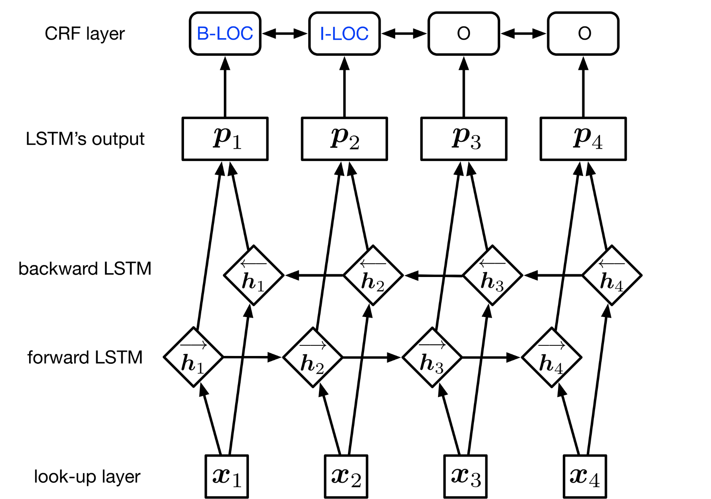
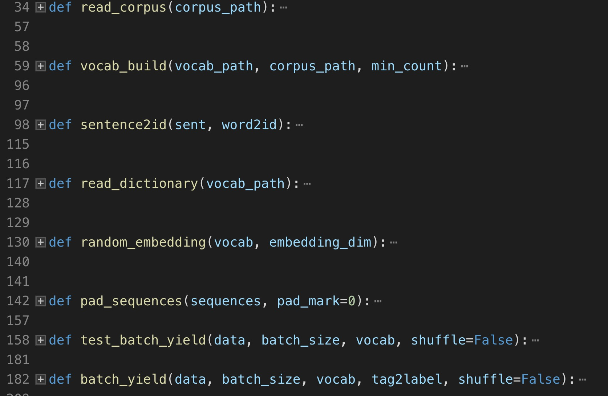
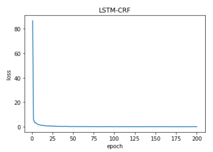
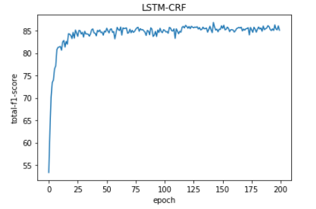
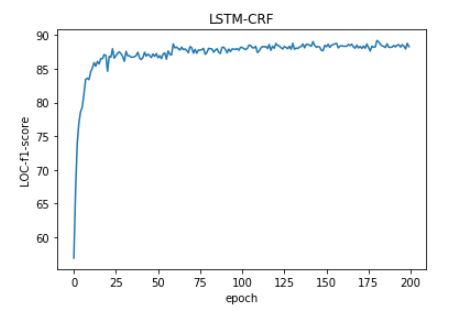
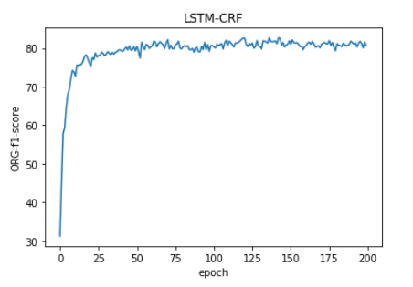
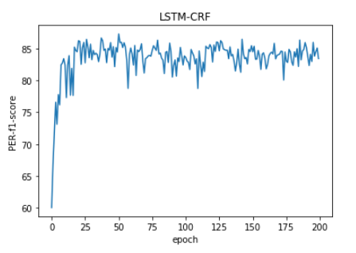

# <center>计算语言学大作业</center>
## <center>使用Bi-LSTM+CRF进行中文命名实体识别</center>

<center>金函琪 180121xxxx xxxx@xxxx.com</center>

<center>王君 1801214001 wj96006@163.com</center>

## 1. 题目探索

### 1.1 中文命名实体和实体识别

一切具有特定属性集合的物体都可以称为实体，中文命名实体一般包括三大类（实体类、时间类、数字类），七小类（人名、机构名、地名、时间、日期、货币和百分比）。

命名实体识别(Named Entities Recognition, NER)是自然语言处理的一个基础任务，其目的是识别语料中人名、地名、组织机构名等命名实体并加以归类，在所有涉及NLP的任务中——譬如信息抽取、信息检索、机器翻——都是一个必须首先攻克的任务。

在本次项目中，位置标签共有两种：
- B- : 命名实体的首词语
- I- : 命名实体首词之后的词  

标记内容共有三种：
- PER: 人名
- LOC: 地名
- ORG: 组织机构名
- O: 其他非命名实体的字

### 1.2 实体识别现有方法

现有的实体识别方法主要有四种，基于规则的方法、基于统计机器学习的方法和深度学习方法

- 基于规则的方法：
  - 早期的实体识别研究，人工构建有限规则，再从文本中寻找匹配这些规则的字符串，是一种主流的方法。研究者们试图借助机器自动地发现和生成规则，再根据语料对规则集合进行无监督的训练迭代得到更多的规则，最终将规则集用于命名实体的分类，该方法对命名实体三种类别(人名、地名和机构名) 的分类准确率均超过了91%。类似的还有使用Bootstrapping进行规则自动生成的方法，和规则和统计模型相结合的实体识别方法。
  - 基于规则的方法虽然能够在特定的语料上获得较高的识别效果。
  - 但是基于规则的方法依赖大量规则的制定，而人工制定这些规则可行性太低。规则对领域知识的极度依赖，使得当领域差别很大时，制定的规则往往无法移植。对这种方法的广泛应用产生了负面影响。

- 基于统计机器学习的方法：
  - 大体分为以下几个方向：选择合适的模型和方法，进行模型和方法的改进，选择合适的特征，多种方法的综合。
  - 选择合适的模型和方法：有两种思路，一种是先识别出文本中所有命名实体的边界，再对这些命名实体进行分类；另一种是序列化标注方法。对于文本中每个词，可以有若干个候选的类别标签，这些标签对应于其在各类命名实体中所处的位置，对文本中的每个词进行序列化的自动标注，整合后获得有若干个词构成的命名实体及其类别。
  - 模型方法改进：改进模型并提高模型的计算效率。根据汉语特点调整和优化经典模型，能够更有效地识别汉语文本中的命名实体，如层叠马尔可夫方法、多层条件随机场方法等。
  - 特征选择：另一种提高NER效果的思路是选择更好的特征表示。通过未登录词和非常规词的识别来提高NER的效果，得到了尝试。为了提高识别的效果，各种全局信息和外部知识如未标注文本（比如知网、未标注文本、人名词典、地名词典等）也作为特征被广泛地应用在NER中。
  - 经典机器学习分类模型如HMM、ME、CRF和SVM都被成功地用来进行命名实体的序列化标注，且获得了较好的效果。
  - 综合的NER方法也取得了较好的效果。比较常见的是模型的混合，如混合多个SVM、混合HMM和ME。统计和规则相结合的方法也较为多见。

- 深度学习进行命名实体识别
  - 借鉴LSTM在自动分词上得到的较好结果，提出LSTM与CRF相结合的模型是目前主流的方法。
  - LSTM和基于转换的两种神经网络模型，同时从标注语料和未标注语料中获取特征，也取得了目前较好的实体识别效果。
  - 除此之外，卷积神经网络(CNN)、 混合神经网络(HNN)等深度学习方法也被成功用来解决实体识别问题，并取得了较好的结果。

## 2. 算法实现

### 2.1 算法综述

我们参照了参考文献[1]中使用双向LSTM和CRF进行实体识别。下图是我们的模型的大致结构。



第一层是 look-up 层，我们使用随机初始化的embedding矩阵将句子中的每个字由one-hot向量映射为$d$维的字向量。在输入下一层之前，我们设置dropout以缓解过拟合。

第二层Bi-LSTM层，它可以有效地使用过去（通过前向过程提取）和未来（通过后向过程提取）的输入信息，并自动提取句子特征。我们将一个句子的各个字的字向量序列$(x_1, x_2, ..., x_n)$作为Bi-LSTM的输入，然后将正向LSTM输出的隐状态序列$(\vec{h_1}, \vec{h_2}, ..., \vec{h_n})$和反向LSTM在各个位置输出的隐状态$(\stackrel{\leftarrow}{h_1}, \stackrel{\leftarrow}{h_2}, ..., \stackrel{\leftarrow}{h_n})$进行按位置拼接得到完整的隐状态序列:

$(h_1, h_2, ..., h_n) \in \mathbb{R}^{n \times m}$


在设置dropout后，接入一个线性层，将隐状态向量从$m$维映射到$k$维，$k$是标注集的标签数，从而得到自动提取的句子特征，记作矩阵P，接下来将接入一个CRF层来进行标注。

$P = (p_1, p_2, ..., p_n) \in \mathbb{R}^{n \times k}$

CRF层进行句子级别的序列标注，在一个句子中标记每个字符的标记。CRF层的参数是一个$(k+2)×(k+2)$的矩阵$A$ ，$A_{ij}$ 表示的是从第$i$个标签到第$j$个标签的转移得分，从而实现在为一个位置进行标注的时候可以利用此前已经标注过的标签。之所以要加2是因为要为句子首部添加一个起始状态以及为句子尾部添加一个终止状态。如果一个句子的标签序列$y=(y_1,y_2,...,y_n)$，那么模型对于句子$x$的标签等于$y$的打分为：

$S(x, y) = \sum\limits_{k=1}^n{P_{i,y_i}} +  \sum\limits_{k=1}^{n+1}{A_{y_{i-1},y_i}}$

可以看出整个序列的打分等于各个位置的打分之和，而每个位置的打分由两部分得到，一部分是由LSTM输出的$p_i$决定，另一部分则由CRF的转移矩阵$A$决定。进而可以利用Softmax得到归一化后的概率：

$P(y | x) = \frac{exp(S(x, y))}{\sum\limits_{y'}{exp(x, y')}}$

模型训练时通过最大化概率对数似然函数进行训练。

模型在预测过程（解码）时使用动态规划的Viterbi算法来求解最优路径：

$\hat{y} = \mathop{\arg\min}_{y'} S(x, y')$

与single Bi-LSTM相比，Bi-LSTM+CRF通过CRF避免获得非标记的标记序列。single Bi-LSTM最后若使用Softmax，只能独立标记每个位置，可能会产生'I-LOC'跟随'B-PER'的情况。相比之下，CRF可以利用句子级别的

如果我们使用Softmax层进行标记，我们可能会获得，因为Softmax只能独立标记每个位置。我们知道'I-LOC'不能跟随'B-PER'，但Softmax不知道。与Softmax层相比，CRF层对序列观察学习各种特征，使用句子级标签信息模拟每两个不同标签的过渡行为，从而避免上述错误的发生。

### 2.2 实现过程

<strong>环境：</strong>

tensorflow1.6  
python3.5

<strong>预处理：</strong>

我们统计了测试集和开发集中各标签的数量：

|  | # total | # O | # B-PER | #I-PER |  # B-LOC | #I-LOC | # B-ORG | #I-ORG |
| :------:| :------: | :------: | :------: | :------: | :------: | :------: | :------: | :------: |
| train | 3990181 | 3626432 | 36488 | 73016 | 56031 | 84848 | 23450 | 89916 |
| train_per | 1 | 0.9088 | 0.0091 | 0.0182 | 0.0140 | 0.0212 | 0.0058 | 0.0225 |
| dev | 172601 | 152505 | 1973 | 3851 | 2877 | 4394 | 1331 | 5670 |
| dev | 1 | 0.8835 | 0.0114 | 0.0223 | 0.0166 | 0.0254 | 0.0077 | 0.0328 |

之后我们对字和label进行了转换，我们的总词表大小为5123，没有进行词表修剪。实现代码在<strong>data.py</strong>中，各个函数如下图。其中，我们使用read_corpus()读入文件并处理，使用vocab_build()函数建立词表并转换，使用random_embedding()生成每个字的字向量。



模型的实现在<strong>model.py</strong>中的BiLSTM_CRF类中。主要函数说明如下：

```
### look up 层 ###
def lookup_layer_op(self):

### Bi-LSTM实现 ###
def biLSTM_layer_op(self):

### 判断是否需要CRF并生成loss function ###
def loss_op(self):

### 训练操作 ###
def train(self, train, dev)
def run_one_epoch(self, sess, train, dev, tag2label, epoch, saver):

### 测试操作 ###
def test(self, test):
```

在<strong>main.py</strong>中，我们读入参数、设置超参数、设置路径，调用model.py进行模型的训练和测试。最终完成中文命名实体识别的任务。

### 2.3 模型训练过程

<strong>运行指令：</strong>

train(Bi-LSTM + CRF):  
```
python main.py --mode=train
```

train(single Bi-LSTM):  
```
python main.py --mode=train --CRF=False
```

eval(加载检查点文件./data_path_save/1545741134/checkpoints/model-53900,在当前文件夹下产生文件results_eval,然后执行命令python ./data_path/eval.py results_eval ./data_path/dev.txt,得到eval结果):  
```
python main.py --mode=test
```

test(加载检查点文件./data_path_save/1545741134/checkpoints/model-53900，在当前目录下生成结果文件results_test):  
```
python test.py 
```

<strong>模型参数：</strong>

- batch_size：256
- hidden_size：300
- word_embedding：300
- learning rate：0.001
- dropout：0.1（使用了dropout来避免过拟合同时提升模型效果）

<strong>实验过程BiLSTM-CRF的loss曲线图如下：</strong>



<strong>总体的F值变化如下：</strong>



<strong>LOC的F值变化：</strong>



<strong>ORG的F值变化：</strong>



<strong>PER的F值变化：</strong>



## 3. 结果分析

### 3.1 Bi-LSTM + CRF 在开发集上的准确率

|  | precision | recall | f1-score | support |
| :------:| :------: | :------: | :------: | :------: |
| PER | 0.8871 | 0.8287 | 0.8569 | 1973 |
| LOC | 0.9145 | 0.8589 | 0.8858 | 2877 |
| ORG | 0.8682 | 0.7724 | 0.8175 | 1331 |
| TOTAL | 0.8958 | 0.8306 | 0.8619 | 6181 |

### 3.2 Single Bi-LSTM 在开发集上的准确率

|  | precision | recall | f1-score | support |
| :------:| :------: | :------: | :------: | :------: |
| PER | 0.8534 | 0.7111 | 0.7758 | 1973 |
| LOC | 0.7984 | 0.7876 | 0.7930 | 2877 |
| ORG | 0.7462 | 0.6228 | 0.6790 | 1331 |
| TOTAL | 0.8047 | 0.7277 | 0.7629 | 6181 |

### 3.3 结果分析

在训练过程中，single Bi-LSTM开发集上准确率明显低于Bi-LSTM+CRF的情况。并且随着 epochs 的提升，在两种方法在开发集上准确率都会随之提升。


## 4. 参考文献

[1]Zhiheng Huang, Wei Xu, Kai Yu. Bidirectional LSTM-CRF Models for Sequence Tagging, 2015.

[2]Sun W, Sui Z, Wang M, et al. Chinese Semantic Role Labeling with Shallow Parsing[C]. empirical methods in natural language processing, 2009: 1475-1483.

[3]Zhou J, Xu W. End-to-end learning of semantic role labeling using recurrent neural networks[C]. meeting of the association for computational linguistics, 2015: 1127-1137.


## 5. 小组分工

- 金函琪：参考代码阅读，编程实现，接口封装。

- 王君：参考代码收集和阅读，部分代码修改，撰写报告。
